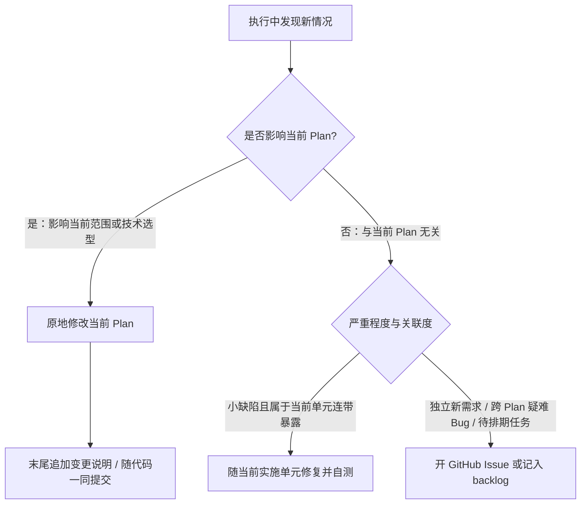

# 产物全生命周期管理规范 (Artifact Lifecycle)

> **核心哲学：** 过程工件活在开发分支，收尾时提炼清理。所有产物从产生时就具有明确的终点，不在主干分支积累历史死文档。

---

## 一、产物分类与生命周期矩阵

| 产物类型 | 物理位置 | 生命周期 | 产生/演进方式 | 终点与归宿 |
| :-- | :-- | :-- | :-- | :-- |
| **Ideation (发想记录)** | `docs/ideation/*.md` | 短期 / 阶段性 | `/nk-ideate` 创建；30 天内同主题再次发想时更新原文件而非新建 | 被选中的方向进入 Plan 后，随消费它的版本收尾删除；未被消费的发想记录不随版本删除，收尾时询问是保留、转为 Issue 还是删除 |
| **Plan (方案与计划)** | 开发分支 `docs/plans/*.md`（格式见 [`plan-format.md`](plan-format.md)） | 短期 / 阶段性 | `/nk-brainstorm` 创建需求部分，`/nk-plan` 补全实施部分，实施过程中根据新发现直接就地修改 | 收尾时提炼架构决策/术语后删除；不留未维护的历史死 Plan，完整过程由 Git 留存 |
| **Review (审查记录)** | 开发分支 `docs/reviews/*.md` | 短期 / 阶段性 | `/nk-review` 创建并追加审查条目 | 修复随代码提交更新；收尾时遗留项转 Issue，文件删除 |
| **Current (会话入口)** | `docs/current.md` | 常驻（单例覆盖） | `/nk-handoff`、`/nk-close` 更新 | 持续覆盖更新，始终反映当前真实状态 |
| **Issue / 待办 / 探针** | GitHub Issues（无远端时降级为 `docs/backlog.md`） | 中期（任务生命周期） | `/nk-to-issue`（核实落档）、`/nk-wayfinder`（探针）、跨 plan 疑难 bug、推迟项 | 完成后关闭（Closed），依靠 Issue 平台状态流转与归档 |
| **Solutions (经验与决策)** | `docs/solutions/<category>/*.md` | 长期 / 永久资产 | `/nk-compound` 沉淀，或收尾时从 plan 提炼 | 永久沉淀；由 refresh 定期审计是否过时或漂移 |
| **Concepts (领域术语)** | 根目录 `CONCEPTS.md` | 长期 / 永久资产 | `/nk-brainstorm` / `/nk-plan` 即时录入，`nk-compound` 补全 | 永久沉淀；由 refresh 定期审计 |
| **项目特有流程** | 项目自选工作流文档（由 `AGENTS.md` 索引） | 长期 | 项目自身维护 | 外部技能读取遵循、不内置、不侵入 |
| **PR 描述 / Release Note** | GitHub PR 描述 / `docs/releases/*.md` | 可选 / 永久 | PR 开启或发版收尾时写入 | PR 合并或版本发布归档 |

> **分支策略由项目决定**：项目工作流文档规定了分支约定就照做；没有规定时留在当前分支、不自动建分支（个人项目常直接在默认分支或 main 上工作）。技能读取项目约定而不内置强制的分支流程。

---

## 二、知识入口的可见性维护 (Discoverability)

为了确保任何新会话或新接入的 Agent 都能快速感知并复用沉淀的知识，必须保持全局指引可见：
* 项目根目录的 **`AGENTS.md`（或等价的全局指令文件）必须包含指向 `docs/current.md`、`docs/solutions/` 和 `CONCEPTS.md` 的显式指引行**。
* **维护责任归属**：在项目首次初始化（bootstrap）或初次运行 `/nk-compound` 时，Agent 应检查 `AGENTS.md`；若缺少对应入口指引，应补充指引声明，确保知识库可被后续会话检索。

---

## 三、过程产物的演化与清理

在过去实践中，大量未收敛的 plan、临时 walkthrough、零碎审查记录长期残留在仓库中，会造成后续任务检索时的上下文污染：

1. **开发期随代码演化**：
   * 在特性或版本分支开发期间，Plan 与 Review 记录是正在生效的工作文档。
   * 随着代码的实现与调试，直接原地修改 Plan 内容，并在末尾追加简要的变更说明。
2. **收尾期清理**：
   * 当版本或特性开发完成准备合并前（或在不使用特性分支的小型项目中收尾时），已交付的 `docs/plans/` 与 `docs/reviews/` 文档应清理删除。
   * **价值提炼**：删除前必须提炼其中具有长期复用价值的内容——重大架构决策与踩坑记录转入 `docs/solutions/`，新术语转入 `CONCEPTS.md`，未竟事项转入 GitHub Issue。
   * 完整的设计演进过程由 Git Commit 历史完整保留。

---

## 四、开发执行中新发现的分流规则

在开发或测试执行过程中，若发现此前未预料到的新需求、变更或边缘缺陷，按以下规则分流处理：

1. **影响当前 Plan 范围或做法**：直接修改当前 Plan 正文，在末尾附一行简单变更说明，随代码一起提交。
2. **与当前 Plan 无关的新需求或疑难缺陷**：不顺手扩大当前任务范围，记录为 GitHub Issue（若无网络则写入 `docs/backlog.md`），保持当前实施单元专注。
3. **伴生的小缺陷**：在当前模块重构或实现中暴露的显而易见小问题，可就地修复并补齐单测，随该单元一同验证提交。

---

## 五、版本收尾六步法 (`/nk-close`)

当一个版本的所有 Plan 实施单元均已交付，**在版本分支合并至 main 分支之前**（或单分支模式的发版收尾节点），执行以下六步闭环流程：

1. **遗留项转移与甄别**：
   * 检查当前分支的审查记录（`docs/reviews/`）与 Plan 中的待办事项；
   * 未完成或计划推迟到后续版本的 Plan，必须先转移成 GitHub Issue 或移至相应后续分支，不可直接遗弃。
2. **价值提炼 (Harvest)**：
   * 将实施中确立的重要架构选型、踩坑因果按 [`solution-schema.md`](solution-schema.md) 提炼写入 `docs/solutions/`；
   * 将新引入的稳定领域术语按 [`concepts-vocabulary.md`](concepts-vocabulary.md) 写入根目录 `CONCEPTS.md`。
3. **清理已交付工件**：
   * 确认无遗留项后，删除本次开发已交付完成的临时 Plan 与 Review 文档（`git rm`）。
4. **更新 `docs/current.md`**：
   * 重写为当前版本交付后的系统状态、已具备能力与后续规划。
5. **单个收尾提交（遵循 R4）**：
   * 发起纯文档收尾提交，提交信息风格遵循项目既有惯例（如 `docs: release vX.Y.Z cleanup` 或 `chore: close vX.Y.Z lifecycle artifacts`）。
6. **发布摘要（可选）**：
   * 若项目走 PR 流程，生成精炼的 PR 摘要或 Release Note。
