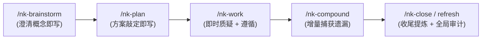

# 领域术语表规范与维护机制 (`CONCEPTS.md`)

> **定位：** 位于代码仓库根目录的 `CONCEPTS.md` 是当前项目业务领域概念的唯一真实术语源（Single Source of Domain Truth）。  
> **核心改进：** 继承 Compound Engineering (CE) 的高质量词条与自成一体原则，解决其“只在 compound 时期录入导致规划期术语流失”的缺陷，吸收 Matt Pocock“在需求与规划敲定时即刻录入”的即时性，并引入即时质疑机制。

---

## 一、准入标准：什么概念配得上收录？

收录一条术语需同时满足以下两条门槛：
1. **领域专属性**：在当前业务域具有明确、具体的业务含义，一名刚接手项目的新工程师或 Agent 若不了解该定义，将难以准确理解业务逻辑、任务说明或代码核心意图。
2. **独立概念性**：它是一个独立的概念，而非已有概念的一个琐碎属性或纯粹的中间临时变量。

### 不予收录的内容：
* **通用计算机/软件工程词汇**：如 `Cache`、`Queue`、`Job`、`Session`、`Worker`、`Retry` 等，即使在项目中频繁出现也不收录。
* **具体代码实现细节**：不出现源码文件路径、类名、函数名、数据库表名或字段名。概念应独立于具体的技术实现。
* **易变的技术配置参数**：不写死具体数字（如“超时设置为 50 秒”），而应描述行为规则（如“各服务根据负载动态设置超时熔断阈值”）。
* **任务追踪与版本标记**：不包含 Issue 编号、PR 链接、状态标签或“目前正由 X 迁移至 Y”等临时叙述。

---

## 二、维护时机与交互机制

与过去 CE 仅在事后总结（compound）时才可能更新术语表不同，NexusKit 规定术语全流程即时维护与互动：



### 1. 规划期即时写入（JIT 录入）
在 `/nk-brainstorm` 明确业务范围和领域模型、或在 `/nk-plan` 敲定技术设计时，一旦确立了核心业务名词，**立即写入根目录 `CONCEPTS.md`**，并随同方案文档一同提交，确保后续会话沟通口径完全一致。

### 2. 即时质疑机制 (Challenge against the Glossary)
当用户或 Agent 在对话、需求描述或代码评审中使用了与 `CONCEPTS.md` 冲突的词汇（例如使用了词条中明确注明的 `*Avoid:*` 同义词，或混淆了两个已明确区分的概念），**应当面当场指出并对齐术语**。术语表不仅是被动查询的字典，更是主动维护认知一致性的标尺。

### 3. 沉淀期增量捕获 (Accretion)
在 `/nk-compound` 沉淀技术方案或排查踩坑时，若遇到此前未被定义且具有非显而易见含义的业务术语，增量补录。

### 4. 存量老项目初建路径 (Bootstrap / Seeding)
JIT 即时写入主要覆盖新涌现的术语。对于尚未建立 `CONCEPTS.md` 的既有老项目，需要通过一次全仓初始化（Bootstrap / Seeding）来提炼核心领域名词。**这项全局初建职责由 refresh 机制（`nk-compound-refresh` 或独立 bootstrap 模式）承担**，通过扫描核心业务模型、对外接口与领域文档完成骨架搭建。

区别于全局初建：`CONCEPTS.md` 不存在时，规划期即时写入可以由第一个合格条目创建该文件，只写本次敲定的术语，不顺带初建整个项目的术语表。

### 5. 版本收尾提炼 (Harvest during Close)
在 `/nk-close` 清理阶段性 Plan 之前，核对 Plan 中是否有值得长期保留的领域新概念，提炼至 `CONCEPTS.md` 后再行删除 Plan。

---

## 三、词条结构与编写规范

### 1. 词条基本格式
每个词条的定义控制在 **1 ~ 2 个自然段**：
* **首段（一句话定义，必须）**：精准概括该概念在当前领域是什么，以及它与邻近概念的本质区别。
* **别名行（可选）**：若存在团队曾用过的同义词或容易引起歧义的混用词，在首句下方用斜体注明，如：`*Avoid: 任务, 待办*` 或 `*Aliases: 订阅者*`。
* **次段（行为与规则，可选）**：用于说明非显而易见的业务约束、状态流转（Lifecycle）、所有权归属（Ownership）或不可逆操作语义。不在此展开具体代码细节。

### 2. 词条示例
```markdown
## 文档解析 (Document Parsing)

### 解析单元 (Parse Unit)
用户提交进行异步图文提取与结构化解析的最小独立文件实体。
*Avoid: 任务, 原始文件*

一个 Parse Unit 在生命周期内归属于一个特定的解析任务批次，生命周期状态包括：Pending、Running、Succeeded、Failed。解析失败可支持有限次原位重试，一旦标记为 Succeeded，其派生结构不可变。

### 证据锚点 (Evidence Anchor)
解析单元输出文本与原始版面像素坐标（或 PDF 页码及 Bounding Box）之间的可核验映射关联。
*Avoid: 溯源引用, 坐标标记*

证据锚点具备反向定位能力，即使输出摘要经过 LLM 重写，锚点映射亦不丢失。
```

---

## 四、支持的变更操作与保全原则

在维护 `CONCEPTS.md` 时，仅允许以下 5 种原子变更：

1. **Add (新增)**：为新确认的合格概念创建新条目，归入对应的领域聚类分组。
2. **Refine (完善)**：在不改变核心内涵的前提下，根据最新业务演进使定义更准确。
3. **Fold (折叠/合并)**：当发现两个词条指代同一事物，或某一概念退化为邻近概念的属性时，将其合并至保留词条中，将被合并的词列入 `*Avoid:*`。
4. **Scrub (净化)**：清除违规写入的代码细节（如类名、表名、路径），使其回归纯粹的领域概念定义。
5. **Retire (退役)**：当某个业务概念下线且无新概念替代，若旧 Issue/历史记录中仍频繁出现，将其一句话归入文件末尾的 `## Retired`。

### ⚠️ 关键保全规则：删除需要正面证据
* **代码被删除不构成删除术语条目的理由**：概念独立于代码实现存在，即使某个实现了该概念的模块或类被重写或删除，业务概念本身往往依然存续。
* **拿不准时保持现状**：只有在掌握明确的正面业务证据表明该概念已彻底不存在时才允许 Retire；若存在不确定性，保留该词条。

---

## 五、文件末尾结构：歧义归档与退役区

在 `CONCEPTS.md` 底部，固定保留以下两个可选章节：

```markdown
## Flagged Ambiguities
* "解析项" 曾被混用于指代 Parse Unit 和 Document Chunk —— 现已明确区分，前者为文件级实体，后者为文本切片。

## Retired
* **Legacy OCR Task**：早期单机 OCR 任务实体，在 v1.2 统一迁移至异步 Parse Unit 后下线。
```
