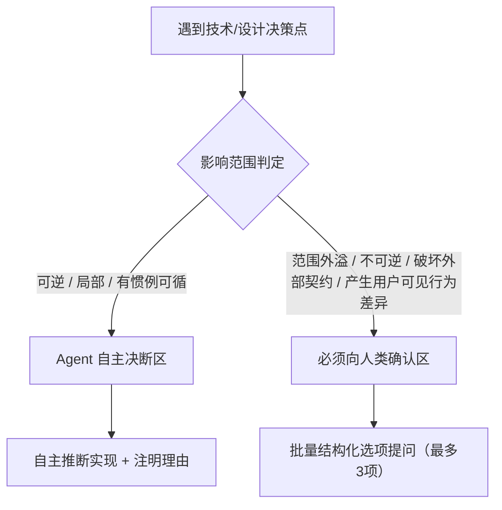

# Agent 决策自主权与提问边界规范 (Decision Autonomy)

> **定位：** 规范 Agent 在需求分析、规划与编码执行中的自主决策权（D6）。  
> **核心原则：** 避免琐碎盘问，推断式实现细节由 Agent 自主决断；坚守安全底线，关键边界与外部契约精炼向人确认。

---

## 一、为什么需要明确决策自主权

在人机结对编程中，通常需要防范两类倾向：
1. **过度盘问（Grill 倾向）**：Agent 将大量可依据上下文、既有代码惯例或技术常识推断的实现细节（如局部命名、内部函数切分、Mock 策略）反复抛回给人类，打断人类思考节奏并消耗认知带宽。
2. **越权决策**：Agent 未经确认擅自改变业务范围承诺、随意修改对外公开 API 或破坏向后兼容性，引发非预期回归。

NexusKit 的核心准则：**推断细节自主决断并记录理由，关键边界选项驱动精炼确认。**

---

## 二、两级决策权分类清单

### 一级：Agent 自主决断区 (Autonomous by Default)
Agent 无需打断人类，直接依据工程惯例做出合理决策，并在 Plan、代码注释或提交说明中简要记录决策理由。

* **适用特征**：
  * **可逆 (Reversible)**：后续调整或重构代价低；
  * **局部 (Local)**：仅影响模块内部或私有实现，不影响跨模块或对外接口；
  * **有惯例可循 (Idiomatic)**：符合当前语言/框架的最佳实践或代码库既有风格。
* **典型场景**：
  1. 模块私有函数、局部变量的命名与实现结构拆分；
  2. 单元测试用例的构造结构、Mock 策略与边缘测试值；
  3. 既定规则之内的防御性判空、常规重试与超时参数设置；
  4. 既有局部代码的重构与防腐精简（在测试全通的前提下）；
  5. 规范的 Git Commit 消息组织。

### 二级：必须向人类发起确认区 (Escalate to Human)
涉及以下场景时，Agent 必须停下并向人类明确确认：

* **适用特征**：
  * **范围外溢 (Scope Expansion)**：超出当前 Plan 或 Issue 明确约定的业务边界；
  * **不可逆影响 (Destructive / Irreversible)**：可能导致数据丢失或破坏向前兼容性；
  * **外部契约分歧 (External Contract Breakage)**：破坏对外的 API、CLI 参数、协议或持久化 Schema；
  * **用户可见行为差异**：对产品最终交互行为、功能表现产生直观影响。
* **典型场景**：
  1. 现有架构无法支撑当前需求，需要引入新的重量级外部依赖或技术栈；
  2. 对外公开 API / CLI / 数据结构的破坏性变更（Breaking Change）；
  3. 改变持久化存储格式，需要考虑数据迁移或兼容旧版本数据；
  4. 涉及安全性、权限控制或身份验证逻辑的底层调整；
  5. 虽有多种可选实现路径，但不同方案会产生明显的用户可见行为差异，或后果落在上述“范围外溢/不可逆/破坏契约”之中（若不产生上述后果，则由 Agent 选择推荐方案并记录理由，无需向人类提问）；
  6. 外部环境硬性阻断（如缺少凭据、私钥或远程服务不可用）。

---

## 三、提问规则与无人值守处理

当需要向人类确认时，严格执行以下提问机制：

### 1. 结构化选项驱动 (Socratic Essentials)
提问应提供清晰的选项与推荐策略，避免提出开放式问题：
* **背景与分歧**：1~2 句话阐明面临的取舍与约束。
* **具体选项 (2 ~ 3 个)**：给出互斥备选方案，附带各自的关键优缺点与代价。
* **明确推荐项**：标注 `(Recommended)` 并简述推断理由。
* 用户只需回复序号（如“选 1”）或简短补充即可完成对齐。

### 2. 批量提问规则 (Batching)
* **合并互不依赖的问题**：若当前决策点包含多个互不依赖的子问题，必须合并在同一轮交互中一次性提出（**单轮最多 3 个问题**），避免一问一答式的繁琐循环。
* **分轮提问仅用于存在依赖时**：只有当问题 B 的前提取决于问题 A 的人类选择时，才在获得 A 的反馈后发起第二轮提问。

### 3. 无人值守模式处理 (Unattended / Headless Execution)
当 Agent 在无人值守、非交互模式或无人类即时响应的运行环境中，若遇到落入“确认区”的决策问题：
* Agent 不应挂起等待；
* **自动采用带有 `(Recommended)` 属性的最佳推断方案推进**；
* 同时在当前工作区的 `docs/current.md` 的阻断/已知缺口章节明确登记该项为 `[待确认]` 状态，附带所选方案与潜在影响，供人类在事后审查。
