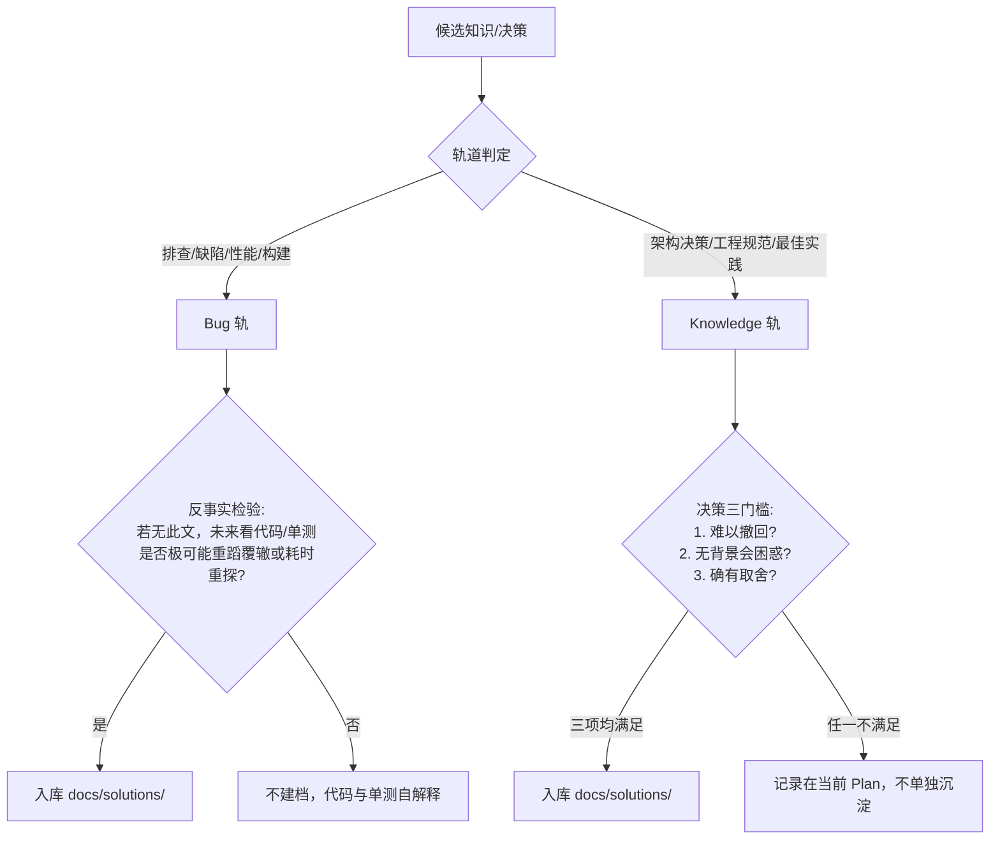

# 经验与决策库规范 (`docs/solutions/`)

> **定位：** 本规范直接基于 Compound Engineering (CE) 的 `schema.yaml` 体系，并将原独立 ADR（架构决策记录）作为 Knowledge 轨的一等公民并入 `docs/solutions/`。  
> **核心原则：** 语料优先（Corpus-First）、双轨准入、格式兼顾自动化检索与书写轻量化。

---

## 一、双轨准入标准

`docs/solutions/` 遵循 CE 的 **Bug Track** 与 **Knowledge Track** 双轨分类，杜绝记录无价值的平庸修改：



### 1. Bug Track（缺陷与排查）
* **反事实检验准入门槛**：假定此文档不存在，未来的开发者仅凭阅读合并后的代码与单测，是否仍有极大概率重蹈覆辙或耗费大量时间重新探究排错？若否，不予建档。

### 2. Knowledge Track（决策与规范）
* **架构决策三门槛（Matt 三条准入）**：
  1. **难以撤回 (Hard to reverse)**：推翻重来的工程或迁移代价巨大（如数据持久化方案、对外 API 契约、核心框架选型）；
  2. **无背景会困惑 (Confusing without context)**：后人读代码会感到意外或试图将故意为之的设计“优化”掉；
  3. **确有取舍 (Real trade-offs made)**：放弃了明确可行的备选方案 A，选了 B，且各自有利弊。常规技术选型不属于此类。

---

## 二、语料优先原则 (Corpus-First)

在归类文档或填写元数据前，**必须先检索 `docs/solutions/` 既有语料**：
1. **目录优先沿用**：优先将新文档存放在既有的子目录中（如 `workflow-issues/`），只有当前领域确实未被覆盖时，才按映射表新建目录。
2. **术语优先沿用**：`component`、`root_cause`、`tags` 等开放词汇字段，优先复用现有文档中已有的拼写与分类，保证全文检索与脚本分析的聚合性。

---

## 三、YAML Frontmatter 规范

基于 CE 规范，以 `problem_type` 驱动轨道分类与字段校验：

### 1. 轨道与 `problem_type` 取值

| Track | 允许的 `problem_type` 取值 | 描述 |
| :-- | :-- | :-- |
| **Bug** | `build_error`, `test_failure`, `runtime_error`, `performance_issue`, `database_issue`, `security_issue`, `ui_bug`, `integration_issue`, `logic_error` | 已排查并修复的明确缺陷或故障 |
| **Knowledge** | `architecture_decision`, `architecture_pattern`, `design_pattern`, `tooling_decision`, `workflow_issue`, `developer_experience`, `best_practice`, `documentation_gap`, `convention` | 架构决策、模式、工具链约定与工作流经验 |

### 2. 字段规范模板

```yaml
---
title: "简明中文标题"
date: 2026-09-25
problem_type: workflow_issue # 见上表取值
component: development_workflow # 开放词汇，语料优先
module: windows_release # 涉及的核心模块名
severity: high # critical | high | medium | low

# --- Bug 轨必填字段（Knowledge 轨选填） ---
symptoms:
  - "可观测的现象或报错信息"
root_cause: "根本技术原因（开放词汇，语料优先）"
resolution_type: code_fix # code_fix | migration | config_change | workflow_improvement 等

# --- Knowledge 轨常用字段 ---
applies_when:
  - "指导适用的条件或场景 1"
tags:
  - release-verification
  - windows-updater

# --- 架构决策专用字段 (当 problem_type 为 architecture_decision / tooling_decision 时可选) ---
status: accepted # accepted | superseded | deprecated
superseded_by: null # 若被后续新决策取代，填写相对路径，如 ../architecture-patterns/new-choice.md

# --- 外部退役触发条件 (选填) ---
retire_when: "当外部上游 bug 修复或某一特定外部依赖版本升级后可废除此项"
---
```

---

## 四、正文编写规范

### 1. 缺陷排查型正文模板
```markdown
# [中文标题]

## Context
说明问题暴露的业务场景、具体报错日志或非预期行为。

## Root Cause
剖析导致该问题的底层原因与因果链，避免停留在表面现象。

## Guidance / Solution
详细记录修复方案、核心改动逻辑与落地指引。

## Why This Matters
说明该问题可能引发的连锁反应或隐蔽故障。

## Prevention & Detection
说明如何在开发期、CI 阶段或通过静态检查提前预防同类问题。
```

### 2. 架构决策型正文模板（支持两档粒度）

针对决策类记录，兼顾轻量与深度，支持两种合法形式：

#### 档位 A：轻量形式（1 ~ 3 自然段，适用于明确聚焦的决策）
```markdown
# [决策标题]

## Context & Decision
面临什么样的技术/业务约束，我们决定采用什么方案，而不是备选方案。

## Why & Trade-offs
选择该方案的核心理由，以及接受了什么妥协/代价（为什么这并非显而易见的选择）。

## Downstream Impact
对下游实现或未来维护者的具体指导与注意事项。
```

#### 档位 B：结构化形式（适用于重大顶层架构取舍）
包含 `## Context & Problem Statement`、`## Decision Drivers`、`## Considered Options`、`## Decision Outcome`、`## Consequences` 五个小节。
