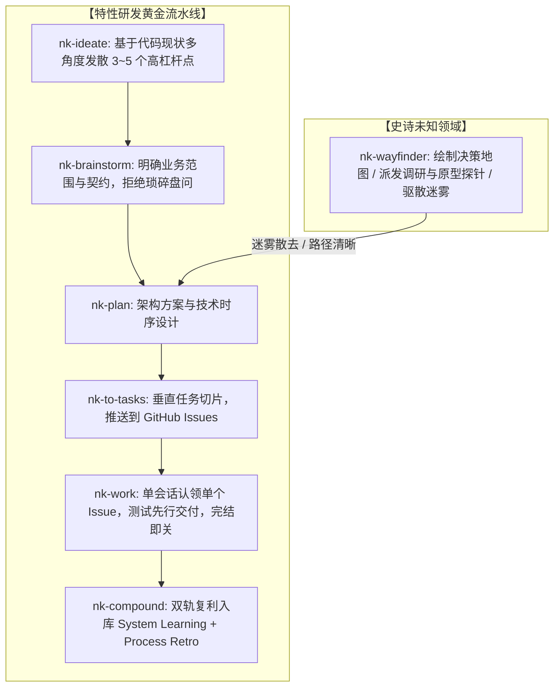

# NexusKit 体系架构立项与设计构想 (Ideation RFC)

> **Document Version:** 1.0.0  
> **Date:** 2026-09-25  
> **Status:** Approved Draft  
> **Author:** steven123397 & Antigravity  

---

## 一、背景与实战反思 (Context & Motivation)

在真实复杂业务（如科研文献快速研读工具 `paper-30min`）的长期高强度实战演进中，我们深度实践了目前 AI 编程领域最具代表性的两套体系：
1. **Matt Pocock Skills**（以 TypeScript 大师 Matt Pocock 为代表的轻量结对体系）；
2. **Compound Engineering (CE)**（EveryInc 团队开发的工业级复利工程插件）。

在数周的实战落地中，我们深刻体会到了两者的精妙之处，但也踩到了极度痛苦的工程暗坑。本构想文档旨在客观复盘两套体系的得失，并确立 **NexusKit (`nk-*`)** 的架构根基。

---

## 二、两套体系的深度得失复盘

### 1. Compound Engineering (CE) 的优势与致命软肋

#### ✅ 核心优势：
* **严谨的工程思维与架构契约**：从 `ideate` ➔ `brainstorm` ➔ `plan` 流程层次分明，抓大放小，不纠结细枝末节。
* **经验复利（The Compounding Effect）**：通过 `ce-compound` 将非显而易见的深层因果沉淀为 `solutions/` 和 `CONCEPTS.md`，彻底治愈了 Agent 跨会话失忆的顽疾。

#### ❌ 致命软肋：
1. **缺乏上下文管理，主代理（Orchestrator）不可避免地走向雪崩**：
   * 在执行（`work`）阶段，CE 倾向于由一个常驻主代理承包一整份大计划。
   * 即使途中分发给子代理，主代理的对话上下文依然迅速飙升至 50 万甚至上百万 Token。
   * 导致模型产生严重的**注意力衰减（Attention Drift）**，出现胡乱修改无关代码、遗忘最初约束、响应迟钝以及费用爆炸的雪崩效应。
2. **工件泛滥（Artifact Sprawl）与仓库污染**：
   * CE 坚持把所有的临时计划、评审记录全写成本地 Markdown（`docs/plans/YYYY-MM-DD-*.md`, `docs/reviews/*.md`）。
   * 随着迭代推进，仓库堆积几十个“死文档”。删了丢失决策链路，留着又让仓库代码树极其混乱，且完全无法实现类似 Issue 的标签筛选、线程追溯与一键关闭。

---

### 2. Matt Pocock Skills 的优势与实际体验痛点

#### ✅ 核心优势：
* **原生集成 GitHub Issues 进行任务管理**：
  * 将规划拆解为垂直切片（Tracer-bullet Tickets），直接通过 GitHub Issues 追踪状态与阻塞关系（`Blocked by`）。
* **天然守护上下文（Fresh Context Window）**：
  * **一个任务 = 一个干净独立的新会话**。每次执行只需关注当前切片，上下文永远在模型最佳认知区间运作。
* **超前的宏观迷雾设计**：
  * 提出了 `Wayfinder`，在面对超大规模未知目标时，用“决策探针”层层探明迷雾。

#### ❌ 实际体验痛点：
1. **`grill`（盘问）过于繁琐，破坏心流**：
   * 原生 `grilling` 流程假设开发者处于完全懵懂状态，往往像查户口一样连环抛出多轮 Q1/Q2/Q3。
   * 实际开发中，开发者心中已有大体构想，而 Agent 却把大量的细枝末节配置和推断式选择全抛回给人类，极度违背“AI 替人类分担认知负荷”的初衷。
2. **缺乏系统级长期资产沉淀**：
   * 偏重单次会话与交付，缺乏类似 CE 的知识库累积机制。

---

## 三、NexusKit 的五大核心架构范式

基于上述复盘，NexusKit 确立了不可动摇的五大核心设计范式：

```
                    ┌──────────────────────────────────────────────┐
                    │            NexusKit 五大核心范式             │
                    └──────────────────────┬───────────────────────┘
                                           │
         ┌──────────────────┬──────────────┴─────┬──────────────────┬─────────────────┐
         ▼                  ▼                    ▼                  ▼                 ▼
 1. GitHub Issues    2. 上下文边界守护    3. 敏捷需求对齐    4. 纯粹迷雾寻路    5. 双轨经验复利
  作为一等公民        (200k~300k/Task)     (Ideate+Brainstorm)  (Wayfinder探针)    (代码+流程Retro)
```

### 范式 1：GitHub Issues 作为动态协作一等公民 (1st-Class Issue Tracking)
* **原则**：废弃 CE 在本地大量生成临时 Plan/Review Markdown 的做法。
* **设计**：
  * 计划与规范转化为 GitHub Parent Issue / Milestone；
  * 拆解的具体任务转化为 GitHub Task Issues，直接利用 GitHub 原生的标签（`ready-for-agent`）、依赖关系与完成状态关闭；
  * 本地 Git 树只保留真正有长效价值的核心代码与架构知识库，保持绝对整洁。

### 范式 2：严格的单任务上下文边界守护 (200k~300k Tokens Envelope)
* **原则**：拒绝单主代理通吃大 Plan。
* **设计**：
  * 切分任务时不搞微观碎片化（Micro-tasking），而是切分为具备独立业务价值的**垂直切片（Vertical Slice）**；
  * 每个 Task 的代码规模和推理过程严格规划在 **200k~300k Tokens** 这一当前模型能力最强、最不漂移的最佳黄金区间；
  * 每一个 Task 开启一个干净的会话（Fresh Session），交付自测后直接 Commit 并关闭 Issue，绝不拖泥带水。

### 范式 3：自主默认，克制对齐 (Autonomous Defaults & Socratic Essentials)
* **原则**：彻底废止无休止的繁琐 Grill。
* **设计**：
  * 采用 `nk-ideate`（基于当前代码库的 6 透镜高杠杆方案发散）与 `nk-brainstorm`（轻量定界）；
  * Agent 具备工程自主性：常规技术实现、常规命名、可由环境推断的配置，**一律自行决策**；
  * 仅当遇到涉及业务范围扩张、破坏性架构选型等高杠杆核心分歧时，才以清晰的选项方式向人类发起对齐。

### 范式 4：纯粹的史诗级迷雾寻路器 (Pure Wayfinder)
* **原则**：不把 Wayfinder 降级为日常任务雷达（GitHub 界面本身已非常直观），回归其处理“超级未知大目标”的本真。
* **设计**：
  * 仅在面对规模极大、未知数极多、无法立即编写技术 Plan 的史诗目标时触发；
  * 在 GitHub 上建立 `[Map] Destination`，发射 `research`（技术预研）、`prototype`（体验原型）、`decision`（决断）探针，逐一扫清迷雾；
  * 迷雾驱散完毕后，自然平滑交棒给 `nk-plan` 与 `nk-to-tasks`。

### 范式 5：双轨经验复利系统 (Dual-Track Compounding)
* **原则**：同时关照“业务系统本身的资产增值”与“人机协作流程的自我进化”。
* **设计**：
  * **系统知识轨（System Learning）**：每当攻克非平凡的技术暗坑，萃取核心因果，写入 `docs/solutions/`，并更新 `CONCEPTS.md` 业务术语表；
  * **协作复盘轨（Workflow Retro）**：复盘会话中 Agent 的跑偏或指令模糊，将最佳工程实践更新至项目的 `AGENTS.md` 或规则提示词中。

---

## 四、NexusKit 黄金流水线时序设计



---

## 五、核心技能映射与实施规划 (Roadmap)

我们将按照工程依赖顺序分阶段实现全套核心技能（统一落位于 `c:\Users\29617\.agents\skills` 并在 GitHub 维护）：

| 阶段 | 核心技能 | 目标定位与关键点 |
| :--- | :--- | :--- |
| **Phase 1: 骨架与切片** | `nk-to-tasks`<br>`nk-work` | • 实现 Plan 到 GitHub Issues 的自动切片、打标、关联依赖<br>• 定义 Fresh Session 单任务高专注度执行规范 |
| **Phase 2: 规划与设计** | `nk-brainstorm`<br>`nk-plan`<br>`nk-ideate` | • 摆脱繁琐 Grill，实现轻量克制的需求对齐（WHAT）<br>• 架构契约与测试设计（HOW）<br>• 基于代码库事实的多透镜方案生成 |
| **Phase 3: 诊断与质控** | `nk-debug`<br>`nk-simplify`<br>`nk-tdd` | • 5 阶段因果链排错 + 2 秒极速变红反馈闭环<br>• 交付后代码防腐精简与测试驱动指导 |
| **Phase 4: 寻路与复利** | `nk-wayfinder`<br>`nk-compound` | • 史诗未知目标决策地图与探针派发<br>• 业务知识库（`solutions/`）与协作流程复盘（Retro）双轨落地 |

---

## 六、结语

NexusKit 不是简单的提示词拼凑，而是一次**站在真实高强度工程实战肩膀上的系统化重构**。它以实用主义为准绳，让每一次人机交互保持极高能效，让每一个 Agent 会话工作在最清爽的上下文区间，并让每一次交付都切实转化为团队的永久工程资产。
