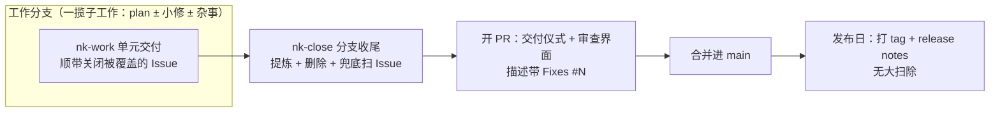

# Issue 生命周期规范与分支生命周期收尾 - Plan

## Goal Capsule

- **Objective**：NexusKit 的 Issue 从创建、认领、关闭的每个环节都有机制承载而不靠自觉；收尾锚点从"版本合并"移到分支生命周期；PR 恢复为交付仪式与审查界面；体系新增手动盘问技能 nk-grill。
- **Means**：改写 3 份共享约定/技能文本 + 新增 `nk-grill` 技能 + `nk-close` 新增 PR 描述规范 reference（KTD1–KTD4）。
- **权威顺序与停止条件**：Issue #4/#5/#6 正文及评论是需求来源，与本 plan 冲突时以 Issue 中的用户拍板为准；实施中发现今天已标注的决策不可行时停下报告，不擅自推翻。

## Product Contract

### Summary

落地 2026-09-26 讨论定型的 v0.1.x 迭代：Issue 规范三处细化（#6）、收尾锚点改为分支生命周期（#5）、新增手动盘问技能 nk-grill（#4）。改动集中在 `skills/conventions/` 三份约定、`nk-work`/`nk-plan`/`nk-close` 三个技能文本与一个新建技能。

### Problem Frame

今天使用讨论暴露了三个真实缺口：Issue 的认领与关闭没有机制（Matt 体系中 ticket 即工作单元所以不会忘关，本体系 Issue 可被 plan 吸收，链路断了）；收尾绑在"版本合并"上，paper-30min 的 1.2.0→2.0.0 大跨度下会积压成大爆炸；用户在对领域认知浅时想要一个可主动调用的盘问入口，而 D6 当年只否决了"强制盘问"。

### Requirements

R1. 标签最小化：用 GitHub 默认标签表达类型（bug/enhancement），不设状态标签（状态由 open/closed 与 `docs/current.md` 承载）；`nk-wayfinder` 的 `wayfinder:*` 前缀标签是唯一例外。
R2. Issue 接取机制：主机制为 `gh` assignee（对仓库持有者是可见的协作信号）；`nk-work` 直接认领时同步在 `docs/current.md` 登记；`nk-plan` 将既有 Issue 纳入 plan 范围的那一刻即认领（assignee + 在 Issue 下评论指向 plan 文件），对应单元交付后关闭。
R3. Issue 关闭三个时机：`nk-work` 提交覆盖该 Issue 的单元时关闭并注明单元编号；PR 合并时经 `Fixes #N` 自动关闭；`nk-close` 收尾时兜底扫描本分支引用过而未关闭的 Issue。
R4. Issue 模板的 Acceptance criteria 改为可选的"完成定义"：纯文本 bullet、不用 checkbox；构想/需求描述类 Issue 整体豁免该小节。
R5. 收尾锚点为分支生命周期：plan 与审查记录活在当前工作分支，合并前收尾；分支不对应发布版本；发布是 main 上打 tag + release notes 的纯事件，无大扫除。
R6. 带 plan 的工作不强制上分支：直接推 main 时按降级路径——plan 全部单元交付时对该 plan 跑一次收尾。
R7. PR 恢复交付仪式与审查界面定位：`nk-close` 第 6 步引用新增的精简版 PR 描述规范（value-first、长度随改动规模伸缩、对应 Issue 用 `Fixes #N` 闭环）。
R8. 新增 `nk-grill`：手动触发的盘问微技能——设计树 + 前沿轮次 + 每问带推荐答案，事实查证归 Agent；不强制产生文档产物。

### Key Decisions

- 收尾锚点定为分支生命周期 (session-settled: user-directed — chosen over 按 plan 增量收尾： 分支是一揽子工作的容器，按 plan 收尾会让无产物的顺带小修漏出范围)。Governs R5、R6。
- 发布与收尾解耦，release = 打 tag + release notes (session-settled: user-approved)。Governs R5。
- 接取主机制为 gh assignee (session-settled: user-directed — chosen over 仅 current.md 登记： assignee 是仓库持有者可见的进度信号，且兼容未来 2-3 人协作)。Governs R2。
- 验收标准改为可选"完成定义" (session-settled: user-directed — chosen over 强制 checkbox 模板： 勾选无人维护，判据服务接手方而非进度追踪)。Governs R4。
- 标签最小化 (session-settled: user-approved)。Governs R1。
- nk-grill 手动触发、不强制产物 (session-settled: user-directed)。Governs R8。
- PR 描述规范取中间档 (session-settled: user-approved — chosen over 仅加衔接语句 / 全量移植 CE： 保留 CE 的 value-first 哲学与规模伸缩原则，不引入其 stack/teaching/branding 机制)。Governs R7。

### Success Criteria

- `python tests/run_checks.py` 五项全绿，CI 通过。
- `npx skills add <本仓库> --list` 的发现列表包含 `nk-grill`；junction 加载路径下 `nk-grill` 可读。
- Issue 全生命周期（创建→认领→关闭）的每个环节在约定文本中有明确机制条款。
- paper-30min 下一个版本周期可直接按新的分支收尾规则执行。

### Scope Boundaries

- 不处理 Issue #1（提示词副本终局，触发时机未到）、#2（中文触发验证，v1.1.0）、#3（增强泊车场，未拍板）。
- 不引入 CE 的 PR 技能族（babysit-pr、resolve-pr-feedback、commit-push-pr 本体）；PR 描述只出精简规范。
- 不改变 `decision-autonomy.md` 的批量提问规则；nk-grill 是用户主动盘问，与 Agent 拿不准时的提问不冲突。
- 分支命名与是否强制 PR 流程归各项目自己的工作流文档，本 plan 不发明。

#### Deferred to Follow-Up Work

- 多人协作真出现时，评估移植 CE 的 PR review 反馈处理类技能。
- paper-30min 迁移验收（v0.2.0 目标）中实战检验新的分支收尾规则。

### Sources

- Issue [#4](https://github.com/steven123397/nexuskit-skills/issues/4)、[#5](https://github.com/steven123397/nexuskit-skills/issues/5)、[#6](https://github.com/steven123397/nexuskit-skills/issues/6) 及评论（含设计推理链）。
- Matt `grilling` 上游原文：`D:\codex_project\upstreams\matt-pocock-skills\skills\productivity\grilling\SKILL.md`。
- CE PR 描述规范：`D:\codex_project\upstreams\compound-engineering-plugin\skills\ce-commit-push-pr\references\pr-description-writing.md`。

## Planning Contract

### 关键技术决策

KTD1. `issue-writing.md` 是 Issue 生命周期规则的唯一持有者：R1–R4 的全文只写在那里；`nk-work`、`nk-plan`、`nk-close` 各加一行指针引用，不重述——防止 K 编码悬空事故重演（规则住会过期的产物曾导致引用悬空）。
KTD2. PR 描述规范新建为 `skills/nk-close/references/pr-description.md`（约 40 行），蒸馏自 CE 同名 reference：保留"写 diff 看不出来的东西"、长度随规模伸缩、`Fixes #N`；裁掉 stack 模式、概念教学归档、branding。挂 `nk-close` 第 6 步。 (session-settled: user-approved — 中间档，见 Key Decisions)
KTD3. `nk-grill` 以 Matt `grilling`（28 行）为骨架移植：设计树、前沿轮次（一轮问完整个前沿）、每问带推荐答案、事实查证归 Agent 而非用户；改为中文体例、`disable-model-invocation: true`、完成标志=前沿清空且用户确认达成共识；与 decision-autonomy 的边界写一句话（谁主动：用户 vs Agent）。 (session-settled: user-directed — 手动无产物)
KTD4. `nk-close` 保持六步骨架，改触发语义与范围：触发从"版本合并前"改为"工作分支合并前"，第 0/1 步的核对范围扩到分支上全部产物（含顺带小修的决策点）；新增"发布日扫尾"小节（漏网检查 + release notes + 打 tag），发布日不再做提炼删除。

### 高层设计

新生命周期（合并前收尾、发布解耦）：

### 假设

- 本仓库自身实施本 plan 时走直推 main 的降级路径（R6），不为体系改动开分支。
- 本仓库按发布模型消费：客户端加载的是插件/npx 安装快照，仓库内改动经重装插件进入客户端视野；不再依赖 `~/.agents/skills` junction。

## Implementation Units

### U1. Issue 生命周期规范落地

- **Goal**：Issue 的标签、认领、关闭、完成定义四组规则在 `issue-writing.md` 成文，三个技能各加指针。
- **Requirements**：R1、R2、R3、R4（KTD1）。
- **Dependencies**：无。
- **Files**：`skills/conventions/issue-writing.md`、`skills/nk-work/SKILL.md`（Intake 段加一行）、`skills/nk-plan/SKILL.md`（收尾段加一行）。
- **Approach**：改写 `issue-writing.md`——新增"标签约定"小节（R1）、"认领"小节（R2 两条路径）、"关闭时机"小节（R3 三条，其中 PR 合并条提及 `Fixes #N` 并指向 `nk-close` 的 PR 描述规范）；Acceptance criteria 小节改为可选"完成定义"（R4）。`nk-work` Intake 的 Issue 来源处加一行"认领按 `../conventions/issue-writing.md` 执行"；`nk-plan` 收尾段加一行"plan 吸收既有 Issue 时按 `../conventions/issue-writing.md` 执行认领"。
- **Test scenarios**：`run_checks.py` 五项全绿（正常路径）；`grep -n "Acceptance criteria" skills/conventions/issue-writing.md` 无勾选框模板残留（边界）；三处指针引用目标文件存在（集成，由链接检查覆盖）。
- **Verification**：`python tests/run_checks.py` 全绿；人工通读 issue-writing.md 确认四组规则各自一句话可执行。

### U2. 新增 nk-grill 技能

- **Goal**：用户可手动调用盘问微技能，按 KTD3 的形态落地。
- **Requirements**：R8（KTD3）。
- **Dependencies**：无。
- **Files**：`skills/nk-grill/SKILL.md`（新建）、`README.md`（路由表加一行）、`docs/skill-sources.md`（新增 nk-grill 条目）。
- **Approach**：以 Matt `grilling` 原文为骨架中文化：设计树、前沿轮次、推荐答案格式、"事实查证归 Agent"（含不阻塞原则）、"前沿清空且用户确认后才行动"。加 NexusKit 体例段（完成标志、工作原则、与 decision-autonomy 的边界一句、不强制产物声明）。`disable-model-invocation: true`。
- **Test scenarios**：`run_checks.py` 全绿，frontmatter 检查确认 `name: nk-grill` 与目录同名（正常路径）；`npx skills@1.5.23 add <本仓库路径> --list` 输出含 nk-grill（集成）；本地重装插件（`/plugins install D:\codex_project\nexuskit`）后 Kimi Code 中 nk-grill 可被调用（集成，发布模型的正式验证通道）。
- **Verification**：上述命令实际运行通过；`docs/skill-sources.md` 条目写明来源与取舍。

### U3. 分支生命周期收尾改造

- **Goal**：收尾锚点从版本合并移到分支生命周期，发布解耦，降级路径写明。
- **Requirements**：R5、R6（KTD4）。
- **Dependencies**：U1（nk-close 的兜底扫描指针随本单元正文一并定型，避免同一文件两轮改写的语义冲突）。
- **Files**：`skills/conventions/artifact-lifecycle.md`、`skills/conventions/commit-cadence.md`、`skills/nk-close/SKILL.md`、`skills/nk-close/references/harvest.md`（核对"版本"措辞是否需同步）、`docs/skill-sources.md`。
- **Approach**：生命周期矩阵中 plan/review 的"版本分支"改为"工作分支"，终点改为"合并前收尾"；第五章标题与触发改为分支收尾，范围扩到分支全部产物；新增"发布日扫尾"小节（漏网 plan/Issue 检查、release notes、打 tag；明确不做提炼删除）。`commit-cadence.md` R4 第 3 条"版本收尾点"改为"分支收尾点（含发布日扫尾）"。`nk-close` SKILL.md 改触发表述与第 0/1 步范围，写入 R6 降级路径（直推 main 时 plan 交付即收尾），第 1 步纳入 R3 的 Issue 兜底扫描（指针引用 issue-writing.md，不重述）。
- **Test scenarios**：`run_checks.py` 全绿（正常路径）；`grep -rn "版本收尾" skills/conventions/ skills/nk-close/` 仅剩发布日扫尾语境的合法出现（边界）；nk-close 六步仍可逐条机械执行（人工走查）。
- **Verification**：`python tests/run_checks.py` 全绿；人工对照 R5/R6 逐条核对三份文件。

### U4. PR 描述规范与 Fixes 闭环

- **Goal**：`nk-close` 第 6 步有可用的精简 PR 描述规范，`Fixes #N` 闭环接入 Issue 生命周期。
- **Requirements**：R7（KTD2）、R3 的 PR 关闭条。
- **Dependencies**：U3（nk-close 改造完成后挂 reference）；U1（issue-writing.md 结构定型后只动"关闭时机"小节一处）。
- **Files**：`skills/nk-close/references/pr-description.md`（新建）、`skills/nk-close/SKILL.md`（第 6 步引用）、`skills/conventions/issue-writing.md`（关闭时机小节的 PR 条目指向该规范）、`docs/skill-sources.md`。
- **Approach**：按 KTD2 蒸馏 CE 原文：写 diff 看不出来的（意图、验证证据、残余不确定性）；长度随规模伸缩（小改动一句话）；标题沿项目提交风格；对应 Issue 时写 `Fixes #N`；不检查清单式八股。
- **Test scenarios**：`run_checks.py` 全绿（正常路径）；nk-close 第 6 步的引用链接存在（集成，由链接检查覆盖）。
- **Verification**：`python tests/run_checks.py` 全绿；对照 CE 原文确认两条核心原则（value-first、规模伸缩）已保留。

## Verification Contract

- `python tests/run_checks.py`：五项检查全绿。
- CI（GitHub Actions，ubuntu + windows）推送后复跑通过。
- `npx skills@1.5.23 add D:\codex_project\nexuskit --list`：发现列表含 18 个 nk-* 技能（含 nk-grill）与 conventions。

## Definition of Done

- U1–U4 全部交付，各带验证证据提交。
- Issue #4、#5、#6 关闭（评论注明对应提交哈希；本仓库直推 main 不开 PR，`Fixes` 不适用）。
- 会话结束时按 `nk-handoff` 更新 `docs/current.md`（能力清单加 nk-grill、验证结果、下一步指向 paper-30min 迁移验收）。
