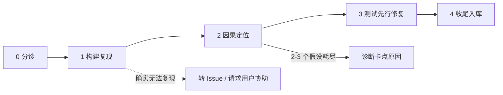

# /nk-debug

> **路径解析说明：** 本文件中引用的参考文件（如 `references/`、`../conventions/`、`../nk-commit/`）均相对于本技能所在目录解析，不在目标代码仓库中查找；`docs/`、`CONCEPTS.md`、`AGENTS.md` 等路径指目标代码仓库。

诊断并修复"行为不符合预期"的开放问题：**先建立可快速变红的复现，再做因果排错**，最后用复现的转绿证明修复。

**完成标志：** 从触发到症状的因果链完整无缺口（附文件:行号证据），且修复按提交节奏入库（回归测试由红转绿）；或诊断结论连同无法定位的原因转记 Issue 并向用户说明。
**工作原则：** 复现优先于推测；一次一个假设、一次一个改动；未运行的验证不记为通过。
**与 nk-work 的边界：** nk-debug 管"行为不符合预期、需要先定位原因"的开放问题；需求与方案明确的实施单元走 [`../nk-work/SKILL.md`](../nk-work/SKILL.md)。

---

## 执行流程

五个阶段顺序执行：分诊 → 复现 → 定位 → 修复 → 收尾。疑难缺陷在每个阶段花更久，不跳过阶段。

### 0. 分诊 (Triage)
读取 [`references/investigate.md`](references/investigate.md) 并遵循：解析输入（输入是 Issue 引用则读全文与全部评论）、琐碎缺陷快速通道、环境体检与脏树 stash 实验。

### 1. 构建复现 (Reproduction First) —— 本技能的核心
**先把缺陷变成一个可快速变红的失败复现，再做任何因果推断。** 读取 [`references/reproduction.md`](references/reproduction.md)：按序构造失败测试 / curl / CLI / 脚本化走查等反馈回路，并持续收紧它（快、确定、断言精确症状）；非确定缺陷以提高复现率为目标。复现必须**因正确的理由失败**——它驱动真实缺陷路径并断言用户描述的精确症状，而不是"附近某处报错"。没有红得起来的复现，就没有资格进入假设阶段。

### 2. 因果定位 (Root Cause)
按 [`references/investigate.md`](references/investigate.md) 的假设纪律推进（假设审计、3~5 个排序假设、支撑观察与预测、智能升级表）；形成假设前先读 [`references/anti-patterns.md`](references/anti-patterns.md)。常规手段不足时按需查阅 [`references/investigation-techniques.md`](references/investigation-techniques.md)（跨组件边界埋点、git bisect、间歇性缺陷、竞态、海森堡缺陷、性能回退、系统边界检查、缺陷类别速查）。**因果链关卡：** 能从触发逐步讲到症状、不含任何"不知怎么就到了"的缺口，才允许进入修复；2~3 个假设被证伪或 3 次修复失败，停下来诊断卡点原因，而不是试下一个变体。

### 3. 修复 (Fix, Test-First)
读取 [`references/fix.md`](references/fix.md) 并遵循：回归测试放在既有覆盖的归属处、确认它因根因变红、最小修复、复现回路对原始场景转绿、跑更广测试防回归、自审 diff 并清除全部调试埋点。测试质量与 Mock 边界遵循 [`../nk-work/references/testing.md`](../nk-work/references/testing.md)。满足触发条件时按 [`references/defense-in-depth.md`](references/defense-in-depth.md) 做分层防御。一次排查含多个相互独立的缺陷时按 R6 分开提交。

### 4. 收尾 (Wrap Up)
- **提交**：读取 [`../nk-commit/SKILL.md`](../nk-commit/SKILL.md)，按 [`../conventions/commit-cadence.md`](../conventions/commit-cadence.md) 提交（修复代码 + 回归测试 + 说明同一提交，R1）；提交说明正文写入实际运行的验证命令、结果与未验证项，并记录正确假设（完整因果链），让下一个排查者能学习。
- **无法本轮定位的疑难缺陷**：转 GitHub Issue（无远端记 `docs/backlog.md`），写入已排除的假设与已收集的证据，并向用户说明（分流规则见 [`../conventions/artifact-lifecycle.md`](../conventions/artifact-lifecycle.md) 第四章）。
- **清理**：确认调试埋点（统一前缀标记）与一次性探针脚本已删除；原始场景的复现回路不再变红。
- **复盘**：生产事故或同一根因模式散布多处时，分析它如何被引入、为何存活至今；值得沉淀的踩坑建议走 `/nk-compound`（一句话即可）。
- 会话结束交接走 [`../nk-handoff/SKILL.md`](../nk-handoff/SKILL.md)。

## 证据脱敏 (Secrets in Evidence)
排错会频繁接触原始输出（命令结果、日志、抓包）。在**构造命令时**就把凭据留在环境变量里；可能含密钥的输出先落盘，再只贴出删节片段（以 `<REDACTED>` 替换每个密钥）。任何密钥不得出现在展示、落档或提交的内容中；若删节后不足以支撑诊断，向用户说明并请求协助，不要去掉删节。

## 提问与无人值守
- 默认先调查后提问；仅当歧义真正阻断排查、且读代码跑测试无法消解时才问。用户流露先前失败尝试（"试了好久""一直失败"）时，先问已试过什么，避免重复死路。
- 落入确认区的问题按 [`../conventions/decision-autonomy.md`](../conventions/decision-autonomy.md) 批量结构化提出；无人值守时采用带 `(Recommended)` 的最佳推断方案推进，并在目标仓库 `docs/current.md` 登记 `[待确认]`。

## 子代理支持 (Subagents，可选)
若客户端支持子代理：假设分属互不依赖的子系统时，可并行派发只读调查子代理（各自携带明确假设与结构化证据返回格式）；子代理不改代码、不执行 `git commit`，证据回传主会话核对。不支持子代理则主会话按假设排序串行执行同样的探针。
